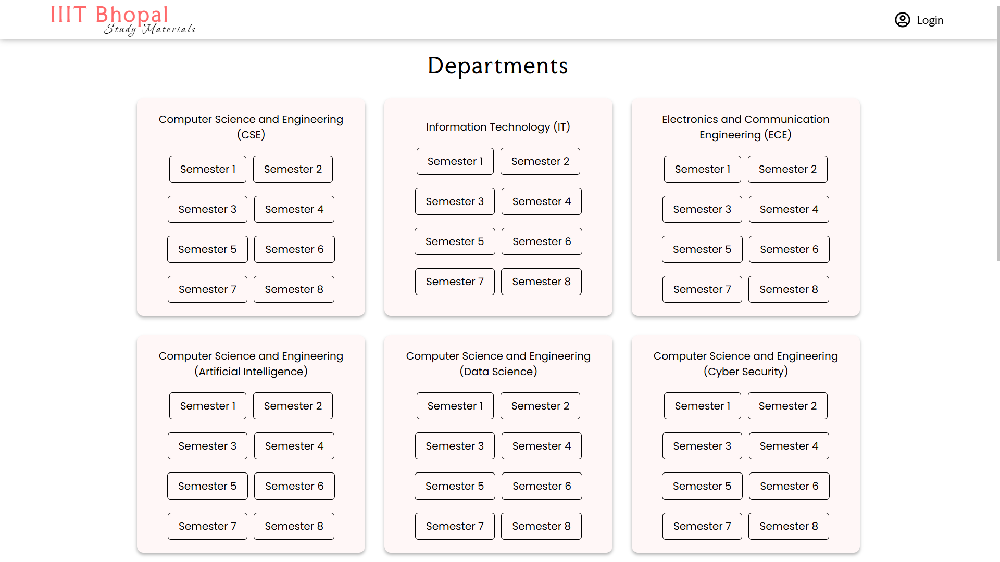
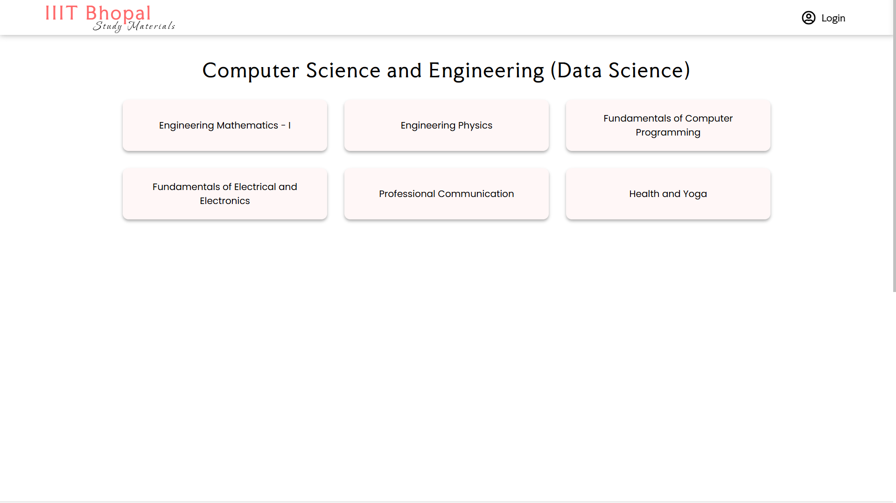
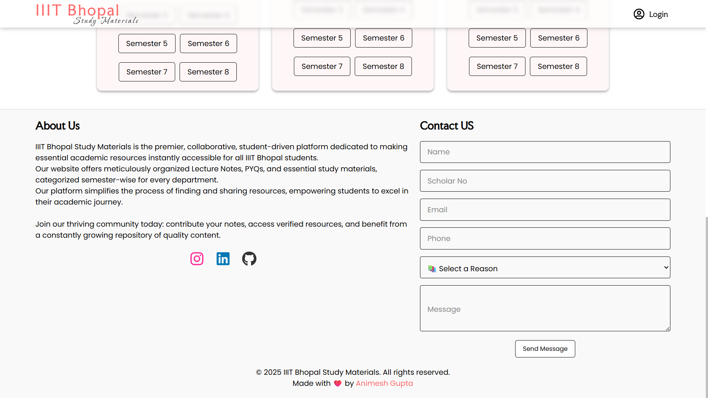
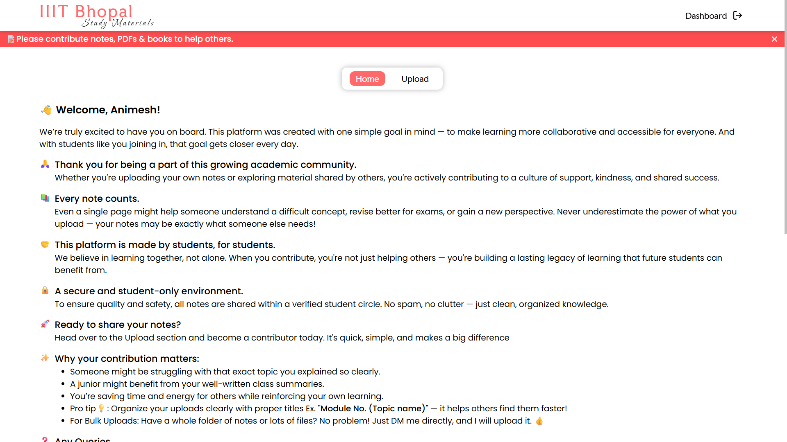

# IIIT Bhopal Study Materials

A centralized web platform for students of the **IIIT Bhopal (Batch 2025-2029)** to easily access and share study materials, academic resources and much more.

**Note:** The source code for this project is private. This repository serves as a public showcase of the live application, its features, and the technologies used to build it.

---

## ✨ Key Features

* **Secure Google Authentication**: Users can sign in easily and securely using their Google accounts via NextAuth.js.
* **Centralized Resources**: Provides a single, organized place for students to find all course-related materials.
* **Fully Responsive**: Designed to work seamlessly on both desktop and mobile devices.

---

## 🛠️ Tech Stack

This project was built using a modern, serverless-first tech stack:

* **Framework**: Next.js (App Router)
* **Styling**: CSS
* **Authentication**: NextAuth.js (Google OAuth Provider)
* **Database**: MongoDB Atlas (Integrated via Vercel)
* **Deployment**: Vercel
* **Integration**: Google Drive

---

## 📸 Project Walkthrough

### 1. Landing Page: Department & Semester Hub
The main entry point where students select their specific Branch (CSE, IT, ECE, etc...) and Semester.

### 2. Subject Selection Interface
After selecting a semester, users are routed to a dynamically filtered list of subjects available for that term.

### 3. Integrated PDF Viewer & File Explorer
A split-screen interface allowing students to read notes on one side while browsing other files in the sidebar without leaving the page.

### 4. Footer & Contact Integration
A feature-rich footer containing a project summary, a functional "Contact Us" form for student feedback, and direct social links (GitHub, LinkedIn, Instagram).

### 5. Live Production Metrics (Vercel)
Real-time dashboard showing system health and user activity.

### Student Dashboard

---

## 🚀 Project Status

This project is **live and operational**. It is actively being used by students of the 2025-2029 batch at IIIT Bhopal.
